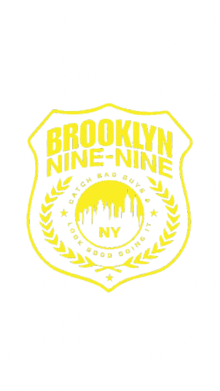

# WDProjMgDelaRosa-Sy

## Inside The 99

### Logo:

### Description:
This webpage aims to hefrgvbfijuhgvdijhbjwdjfhbdhjfbhjikdejfvhbhjikedjhbilovejungwon

### Webpage Breakdown:
1. Main Page: Upon opening the website, the user will be introduced to the main page that contains the main characters of the show. Pressing each character will direct the user to their own webpages; pressing the Brooklyn 99 logo will direct the user to a side bar that has the other webpages of the website. Arrows and lines (red) from the main page indicate a relationship between the characters, e.g., Jake Peralta and Amy Santiago's relationship timeline; The squad's milestones.
   
2. Characters' Pages: Each main character from the main page have their respective webpages that include their biography, important cases, and other details like fun facts or trivias about them.
   
3. Production Page: Production is one of the options in the side bar mentioned above. This webpage will include the story on how Brooklyn 99 started, production dates, cast and crew, and behind the scenes (these will also be separate webpages once the production page is opened.)

4. Episodes Page: This page--which can also be found as an option in the side bar--will include the information and pictures of some of the scenes of all episodes from all eight seasons.

#### Other Notes:
All webpages have the Brooklyn 99 logo that can be found at the top left of the screen, and clicking this will show a side bar of the other subpages.

### Use of JavaScript:
JavaScript is used to toggle the sidebar menu when the Brooklyn 99 logo is clicked. This improves user experience by making navigation smoother and more interactive.

## Wireframes

### Main Page:

### Side Bar:

### Characters' Page:

### Production Page:

#### How it Started & Production Dates:

#### Cast and Crew:

#### Behind the Scenes:

### Link to Canva File (Website Outline):
[linktocanva](https://www.canva.com/design/DAG3DfH2QxU/xfm7vYf55lnqjK7FBn3l4g/edit?utm_content=DAG3DfH2QxU&utm_campaign=designshare&utm_medium=link2&utm_source=sharebutton)
